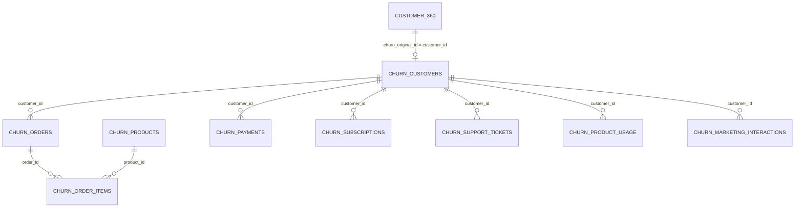

# Implementation Plan - Customer Churn Data Pipeline & Ground Truth Identification

Bài hướng dẫn và kế hoạch thực hiện việc làm sạch dữ liệu, thực hiện các câu lệnh JOIN (SQL-like) từ 10 file CSV trong thư mục `data/`, xác định **Ground Truth** cho bài toán Customer Churn Prediction, và tạo ra dataset hoàn chỉnh phục vụ cho việc huấn luyện mô hình Machine Learning.

---

## 📍 1. Vị trí của Ground Truth (Biến Mục Tiêu / Target Variable)

Sau khi phân tích toàn bộ 10 file CSV, **Ground Truth** cho bài toán Customer Churn Prediction nằm ở:

### 🎯 Master Ground Truth (Cấp Độ Khách Hàng - Customer Level)
* **File:** [`data/churn_customers.csv`](file:///d:/ML_intern/data/churn_customers.csv) (hoặc cột tương ứng trong [`data/customer_360.csv`](file:///d:/ML_intern/data/customer_360.csv))
* **Cột (Column):** `account_status` (kèm theo ngày hủy `closed_date`)
* **Giá trị cụ thể:**
  * `Closed`: Khách hàng đã đóng/hủy tài khoản $\rightarrow$ **`is_churn = 1`** (Ground Truth Positive)
  * `Active`: Khách hàng đang hoạt động $\rightarrow$ **`is_churn = 0`** (Ground Truth Negative)
  * `Inactive`: Tài khoản tạm ngừng/không hoạt động $\rightarrow$ Tùy chọn gom nhóm vào `is_churn = 1` hoặc loại bỏ tùy bài toán.
* **Tỷ lệ phân bố nhãn (sau khi làm sạch trùng lặp):**
  * `Active`: 9,312 khách hàng (~93.06%)
  * `Closed`: 692 khách hàng (~6.92%)
  * `Inactive`: 2 khách hàng (~0.02%)
  * $\rightarrow$ Đây là bài toán **Imbalanced Binary Classification** (Tỷ lệ churn ~6.9%).

### ℹ️ Secondary Ground Truth (Cấp Độ Dịch Vụ Subscription - Subscription Level)
* **File:** [`data/churn_subscriptions.csv`](file:///d:/ML_intern/data/churn_subscriptions.csv)
* **Cột:** `status` (`Active`, `Cancelled`, `Expired`)
* *Ghi chú:* Bảng subscription chỉ áp dụng cho 792/10,006 khách hàng có sử dụng dịch vụ đăng ký gói (Subscription). Do đó, `account_status` ở `churn_customers.csv` mới là nhãn tổng thể cho toàn bộ khách hàng.

---

## 🔍 2. Phân Tích Cấu Trúc Dữ Liệu & Vấn Đề Chất Lượng (Data Quality Issues)

### A. Hiện tượng Trùng Lặp Dữ Liệu (Duplicate Rows)
Một số file CSV bị trùng lặp dữ liệu nguyên khối (do quá trình xuất/lưu trữ):
* `churn_customers.csv`: 830,170 dòng $\rightarrow$ Làm sạch (Drop duplicates) còn **10,006 khách hàng duy nhất**.
* `churn_orders.csv`: 12,004 dòng $\rightarrow$ Làm sạch còn **3,001 đơn hàng**.
* `churn_product_usage.csv`: 4,009 dòng $\rightarrow$ Làm sạch còn **1,003 bản ghi log**.
* `churn_products.csv`: 902 dòng $\rightarrow$ Làm sạch còn **601 sản phẩm**.

### B. Lỗi Dữ Liệu Thời Gian (Timestamp Anomalies)
Một số giá trị trong `closed_date` chứa năm bất thường (ví dụ: `20266-01-01`, `20333-01-01`). Script xử lý dữ liệu sẽ parse thời gian an toàn (coerce errors).

---

## 🗺️ 3. Sơ Đồ Quan Hệ Dữ Liệu & Các Phép JOIN (SQL Entity-Relationship)

### Các Khóa JOIN Chi Tiết (SQL Join Keys):
1. `customer_360.churn_original_id` $\leftrightarrow$ `churn_customers.customer_id`
2. `churn_orders.customer_id` $\leftrightarrow$ `churn_customers.customer_id`
3. `churn_order_items.order_id` $\leftrightarrow$ `churn_orders.order_id`
4. `churn_order_items.product_id` $\leftrightarrow$ `churn_products.product_id`
5. `churn_payments.customer_id` $\leftrightarrow$ `churn_customers.customer_id`
6. `churn_subscriptions.customer_id` $\leftrightarrow$ `churn_customers.customer_id`
7. `churn_support_tickets.customer_id` $\leftrightarrow$ `churn_customers.customer_id`
8. `churn_product_usage.customer_id` $\leftrightarrow$ `churn_customers.customer_id`
9. `churn_marketing_interactions.customer_id` $\leftrightarrow$ `churn_customers.customer_id`

---

## ⚙️ 4. Chiến Lược Gom Nhóm & Ghép Bảng Để Tạo ML Dataset

Vì các bảng giao dịch (`orders`, `payments`, `support_tickets`, `product_usage`, `marketing_interactions`) có quan hệ **1:N (1 khách hàng - N giao dịch)**, nếu JOIN thuần túy không tổng hợp sẽ khiến dữ liệu bị nhân bản (fan-out) và không dùng trực tiếp để huấn luyện ML được.

Chúng ta sẽ thực hiện 2 sản phẩm đầu ra:

1. **`build_dataset.py` (Script Xử Lý & Aggregation)**:
   * **Bước 1:** Khử trùng lặp (Deduplicate) tất cả 10 bảng CSV.
   * **Bước 2:** Xử lý chuẩn hóa nhãn Ground Truth `is_churn` (1 cho `Closed`, 0 cho `Active`).
   * **Bước 3:** Trích xuất feature dạng SQL Aggregations theo `customer_id`:
     * *Đơn hàng (Orders):* `total_orders`, `sum_order_amount`, `avg_order_amount`, `latest_order_days_ago`, `returned_orders_count`.
     * *Sản phẩm mua (Order Items & Products):* `total_items_bought`, `favorite_product_category`, `distinct_categories_count`.
     * *Thanh toán (Payments):* `total_payments`, `failed_payments_count`, `success_payments_count`, `creditcard_payment_ratio`.
     * *Gói dịch vụ (Subscriptions):* `has_subscription`, `subscription_status`, `plan_tier`, `auto_renew`.
     * *Hỗ trợ (Support Tickets):* `total_tickets`, `avg_csat_score`, `avg_resolution_hours`, `urgent_tickets_count`.
     * *Sử dụng sản phẩm (Product Usage):* `total_sessions`, `total_usage_duration_sec`, `avg_session_duration`.
     * *Marketing (Marketing Interactions):* `total_campaigns_received`, `marketing_open_rate`, `marketing_click_rate`, `marketing_conversion_rate`.
     * *Khách hàng 360 (Customer 360 & Demographics):* `age`, `gender`, `region`, `crm_channel`, `account_tenure_days`.
   * **Bước 4:** Thực hiện **LEFT JOIN** tất cả các bảng tính năng đã tổng hợp vào bảng Khách hàng gốc (`churn_customers`).

2. **File Output `data/churn_ml_dataset.csv`**:
   * Dataset hoàn chỉnh sẵn sàng 100% cho việc EDA, Feature Selection, và Train Model (XGBoost, LightGBM, CatBoost, Scikit-learn).
   * **1 dòng = 1 khách hàng duy nhất** (10,006 dòng).

---

## 📋 5. Kế Hoạch Kiểm Thử & Xác Nhận (Verification Plan)

### Automated Tests:
1. Chạy script `build_dataset.py` và kiểm tra log.
2. Kiểm tra shape của `churn_ml_dataset.csv` (Đảm bảo đúng 10,006 dòng, không có rò rỉ hay lặp trùng `customer_id`).
3. Kiểm tra sự hiện diện và phân bố của nhãn target `is_churn` (`1` vs `0`).
4. Kiểm tra tỷ lệ giá trị thiếu (Missing Values / Nulls) và xử lý `fillna()` cho các khách hàng không có giao dịch/ticket.

---

## User Review Required

> [!IMPORTANT]
> **Xác nhận nhãn Inactive:** Trong dataset có 2 khách hàng mang trạng thái `Inactive`. Hiện tại script mặc định coi `Closed` = 1 (Churned) và `Active` / `Inactive` = 0. Bạn có muốn đổi `Inactive` thành 1 (Churned) không?

> [!NOTE]
> Script sẽ lưu kết quả dataset hoàn chỉnh tại `data/churn_ml_dataset.csv`. Tất cả các thao tác SQL JOIN và feature aggregation được thực hiện hoàn toàn tự động bằng Python/Pandas & SQL-style operations.
